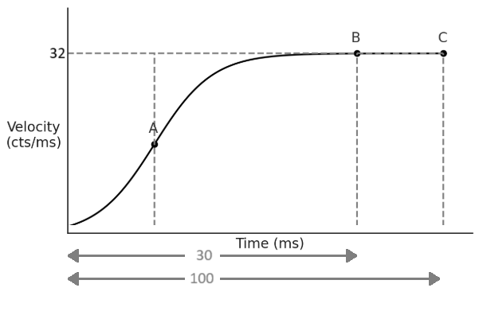
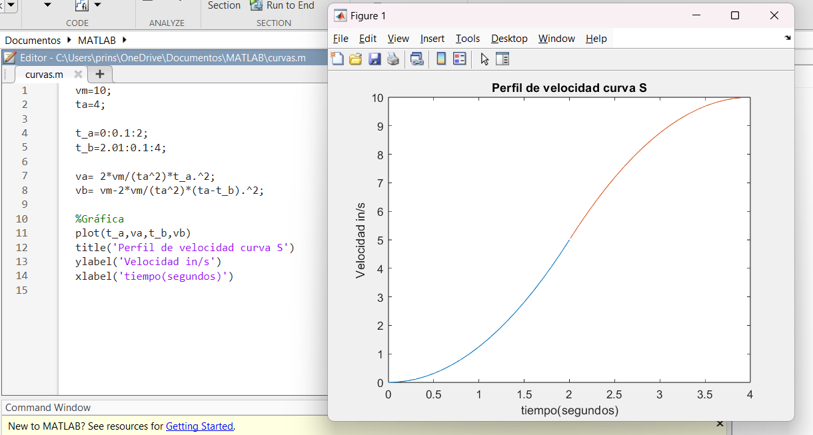
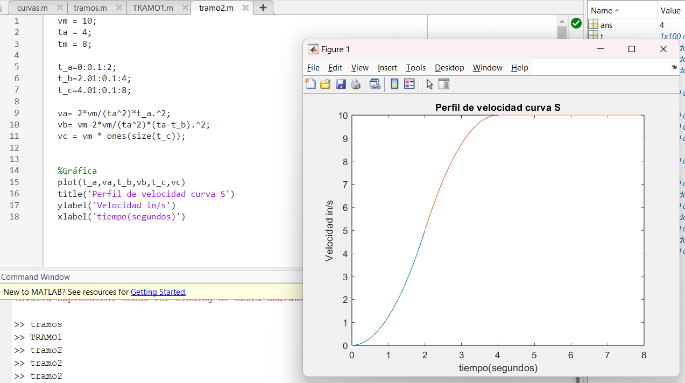

# CLASE 3 II CORTE
# Perfil de Velocidad en Curva S 

##  Tipos de Perfiles de Velocidad

- **Trapezoidal:** Perfil tradicional con aceleración constante, velocidad constante y desaceleración.
- **Curva S (Suavizada):** Cambios suaves en la aceleración, reduciendo vibraciones y desgaste mecánico.
- **Curva S Pura:** Perfil más avanzado, con aceleración suavemente variable desde 0 hasta la velocidad máxima, y luego desaceleración suave.

## Modelo Matemático de la Curva S

Cada segmento del perfil se modela con un polinomio de segundo orden:

$v(t) = C_1 t^2 + C_2 t + C_3$

Donde:
- $C_1, C_2, C_3$ son coeficientes determinados por condiciones de frontera.
- El modelo permite una aceleración variable y controlada.

## Obtención del Modelo – Curva A

### Condiciones Iniciales:
- $v(0) = 0$
- $a(0) = \frac{dv}{dt} = 0$
- Aceleración máxima se alcanza a $t = \frac{t_a}{2}$

### Sustituyendo:
$v(0) = C_1 (0)^2 + C_2 (0) + C_3 = 0 \Rightarrow C_3 = 0$

A partir de   
$v\left( \frac{t_a}{2} \right) = \frac{v_m}{2}$:

$\frac{2v_m}{t_a^2} \left( \frac{t_a}{2} \right)^2 = \frac{v_m}{2} \Rightarrow C_1 = \frac{2v_m}{t_a^2}$

Entonces:

$v(t) = \frac{2v_m}{t_a^2} t^2$

## Cálculo de la Posición

### Perfil en dos fases:

1. Aceleración: $v_A(t) = \frac{2v_m}{t_a^2} t^2$
2. Desaceleración: $v_B(t) = v_m - \frac{2v_m}{t_a^2} (t_a - t)^2$

### Integración para posición:

$s(t) = \int_0^{\frac{t_a}{2}} v_A(t)\,dt + \int_{\frac{t_a}{2}}^{t_a} v_B(t)\,dt$

### Ejemplo 1

A partir del perfil de velocidad obtenga la posición del eje (axis) transcurridos 100 ms

 

$$
v_A(t) = \frac{2v_m}{t_a^2} t^2 \quad\quad v_B(t) = v_m - \frac{2v_m}{t_a^2} (t_a - t)^2
$$

$$
s(t) = \int_0^{15} \frac{2 \cdot 32}{30^2} t^2 \, dt + \int_{15}^{30} \left( 32 - \frac{2 \cdot 32}{30^2} (30 - t)^2 \right) dt
$$

$$
s(t) = \int_0^{15} \frac{64}{900} t^2 \, dt + \int_{15}^{30} \left( 32 - \frac{64}{900} (30^2 - 60t + t^2) \right) dt
$$

Resultado:  

s₀B(t) = 0.023·t³ |₀¹⁵ + (32·t + 0.071·(900·t - 60/2·t² + t³/3)) |₁₅³⁰

$s_{0B}(t) = 77.62 + 480 - 64.12 = 493.49\ \text{cts}$

$s_{0C}(t) = 493.49 + 32 \cdot 70 = 2733.49\ \text{cts}$

#### Ejemplo 2 

Suponiendo que para un perfil de curva s pura se tiene una velocidad máxima de 10 in/s y un tiempo de aceleración de 4 s, grafique el periodo de aceleración en Matlab
  
 

 # Movimiento Multi-Eje

## ¿Qué es el movimiento multi-eje?

Es donde se tienen varios ejes(motores) que tiene que colaborar entre si para llevar a cabo una trayectoria, es decir tienen que sincronizarse, ademas se debe pensar como se realizará la coordinación de estos ejes. Este tipo de movimiento es común en sistemas como impresoras 3D, fresadoras CNC y robots cartesianos.

Existen diferentes formas de implementar estos movimientos:

1. **Movimiento secuencial:** Se mueve un eje a la vez, completando el desplazamiento de uno antes de iniciar el del otro.
2. **Movimiento simultáneo (slew motion):** Ambos ejes se mueven al mismo tiempo, pero sin garantizar que finalicen al mismo instante.
3. **Movimiento interpolado:** Se ajustan las velocidades para que ambos ejes empiecen y terminen juntos, trazando una trayectoria precisa y coordinada.

Para elegir cual es el mejor, se debe ver la aplicación y el resultado que se quiere, sin embargo usualmente se encuentran mas en la industria movimiento simultaneo. 

## Ejemplo de Slew Motion

Considere la máquina de la figura. Si ambos ejes se mueven a una velocidad de $4\ \text{cm/s}$ usando un perfil de velocidad trapezoidal con $t_a = 0.2\ \text{s}$, ¿cuánto tiempo le tomará a cada eje completar el movimiento?

- $L_x=16\ \text{cm}$, $L_y=12\ \text{cm}$
- $v_x=v_y=4\ \text{cm/s}$
- $t_a=0.2\ \text{s}$ (tiempo de aceleración)

### Tiempo de velocidad constante

En un perfil trapezoidal, el tiempo en el que el sistema se mantiene a velocidad constante ($t_m$) se calcula como:

$t_m=\frac{L}{v}-t_a$

Aplicando esto a cada eje:

- Para el eje X:  
$t_{m,x}=\frac{16}{4}-0.2=3.8\ \text{s}$

- Para el eje Y:  
$t_{m,y}=\frac{12}{4}-0.2=2.8\ \text{s}$

### Tiempo total de movimiento

El tiempo total considera la fase de aceleración y desaceleración (ambas iguales a $t_a$):

$t_{\text{total}}=t_m+2t_a$

- Eje X:  
$t_{\text{total},x}=3.8+0.4=4.2\ \text{s}$

- Eje Y:  
$t_{\text{total},y}=2.8+0.4=3.2\ \text{s}$

Como el eje X requiere más tiempo, el movimiento no está sincronizado, lo que es característico de un movimiento tipo *slew*.

## Ejemplo de Movimiento Interpolado

Para el ejemplo anterior, ahora se debería tomar como referencia el perfil de velocidad del eje (axis) que tomará mas tiempo e interpolar para el otro eje (axis), para que ambos terminen al mismo tiempo

### Objetivo

Igualar el tiempo de movimiento de ambos ejes:  
$t_{m,y}=t_{m,x}=3.8\ \text{s}$

Se despeja la nueva velocidad del eje Y a partir de la fórmula:

$t_m=\frac{L}{v}-t_a\quad\Rightarrow\quad v=\frac{L}{t_m+t_a}$

Sustituyendo los valores:

$v_y=\frac{12}{3.8+0.2}=\frac{12}{4}=3\ \text{cm/s}$

Al reducir la velocidad del eje Y a $3\ \text{cm/s}$, se asegura que ambos ejes terminen su movimiento en $4.2\ \text{s}$, logrando una trayectoria interpolada y sincronizada.

## MODELADO CURVA B

$\frac{t_a}{2}<t<t_a$

**Condiciones de frontera**

1. $v\left(\frac{t_a}{2}\right)=\frac{v_m}{2}$  
2. $v(t_a)=v_m$  
3. $a(t_a)=\frac{dv}{dt}(t_a)=0$

**Derivada general:**

$$
v(t)=C_1t^2+C_2t+C_3 \Rightarrow a(t)=\frac{dv}{dt}=2C_1t+C_2
$$

**Aplicamos condiciones:**

**1.**  $C_1\left(\frac{t_a}{2}\right)^2+C_2\left(\frac{t_a}{2}\right)+C_3=\frac{v_m}{2}$

$C_1\frac{t_a^2}{4}+C_2\frac{t_a}{2}+C_3=\frac{v_m}{2}\tag{1}$

**2.**  $C_1t_a^2+C_2t_a+C_3=v_m\tag{2}$

**3.**  $a(t_a)=2C_1t_a+C_2=0\Rightarrow C_2=-2C_1t_a\tag{3}$

**Sustituimos en las ecuaciones (1) y (2):**

Usamos (3) en (1) y (2).

Sustituimos en (1):

$$
C_1\frac{t_a^2}{4}-2C_1t_a\cdot\frac{t_a}{2}+C_3=\frac{v_m}{2}
$$

$$
C_1\frac{t_a^2}{4}-C_1t_a^2+C_3=\frac{v_m}{2}
$$

$-\frac{3}{4}C_1t_a^2+C_3=\frac{v_m}{2}\tag{4}$

**Sustituimos en (2):**

$C_1t_a^2-2C_1t_a^2+C_3=v_m \Rightarrow -C_1t_a^2+C_3=v_m \tag{5}$

**Restamos (5)-(4):**

$$
(-C_1t_a^2+C_3)-\left(-\frac{3}{4}C_1t_a^2+C_3\right)=v_m-\frac{v_m}{2}
$$

$$
-\frac{1}{4}C_1t_a^2=\frac{v_m}{2} \Rightarrow C_1=-\frac{2v_m}{t_a^2}
$$

 **Coeficientes:**

$$
C_2=-2C_1t_a=-2\left(-\frac{2v_m}{t_a^2}\right)t_a=\frac{4v_m}{t_a}
$$

$$
C_3=v_m+C_1t_a^2=v_m-2v_m=-v_m
$$

**Resultado con coeficientes:**

$$
v_B(t)=-\frac{2v_m}{t_a^2}t^2+\frac{4v_m}{t_a}t-v_m
$$

ó

Recordando que:

$$
(t_a-t)^2=t^2-2t_at+t_a^2
$$

Entonces:

$$
v_B(t)=v_m-\frac{2v_m}{t_a^2}(t_a-t)^2
$$

es **equivalente** al polinomio anterior.

## MODELADO C

$t_a<t<t_m$

Modelamos este tramo con:

$$
v_C(t)=C_1t^2+C_2t+C_3
$$

**Condiciones de frontera:**

$$v(t_a)=v_m$$  
$$v(t_m)=v_m$$  
$$a(t)=\frac{dv}{dt}=0$$ en todo el tramo

Derivada general:

$$
a(t)=\frac{dv}{dt}=2C_1t+C_2
$$

Aceleración constante igual a cero:

$$
2C_1t+C_2=0
$$

Por lo tanto:

$$
C_1=0,\quad C_2=0
$$

**Resultado:**

Con \(C_1=0\) y \(C_2=0\), el modelo se reduce a:

$$
v_C(t)=C_3
$$

Resultado final:

$$
\boxed{v_C(t)=v_m}
$$

## EJEMPLO NUMERICO

Se grafica el perfil de velocidad tipo S compuesto por tres tramos diferenciados: aceleración (A), desaceleración (B) y velocidad constante (C), para simular un movimiento suave y continuo.

Los parámetros utilizados para construir el perfil son:

- Velocidad máxima: $v_m = 10\,\text{in/s}$
- Tiempo total de aceleración/desaceleración: $t_a = 4\,\text{s}$
- Tiempo total de movimiento: $t_m = 8\,\text{s}$

Se modelan tres tramos de la siguiente manera:

- **Tramo A** ($0 \leq t < \frac{t_a}{2}$): aceleración creciente, modelada como una parábola ascendente.
- **Tramo B** ($\frac{t_a}{2} < t \leq t_a$): aceleración decreciente hasta cero, modelada como una parábola descendente.
- **Tramo C** ($t_a < t \leq t_m$): velocidad constante igual a $v_m$.

 

